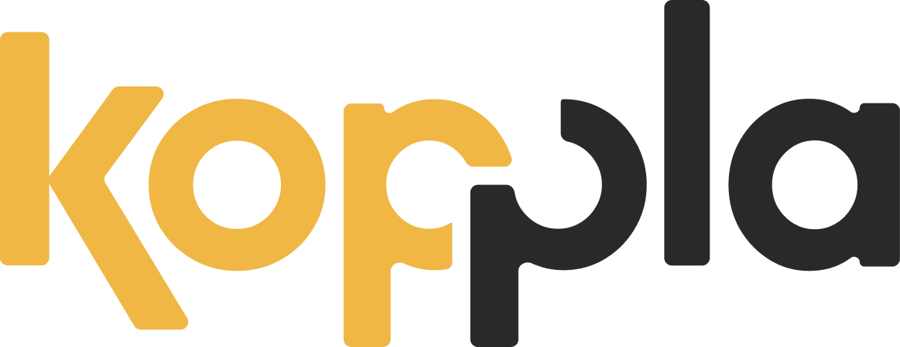
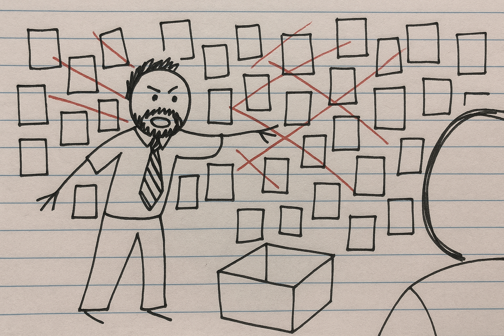
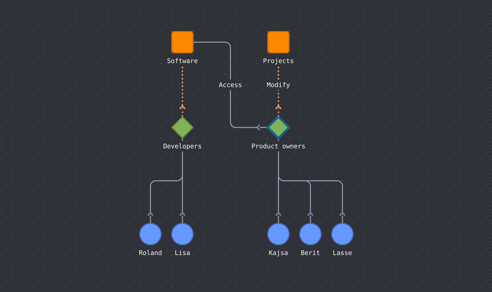

<div align="center">
    <h2>
      <picture>
          <source media="(prefers-color-scheme: dark)" srcset="assets/koppla-logo.png">
          
        </picture>
    </h2>
</div>

<p align="center">k'ɔpːla</p>
<h4 align="center">Connect everything</h4>

<div align="center">
  <picture>
    
  </picture>
</div>

<h2 align="center">WORK IN PROGRESS - NOTHING IS FINALIZED</h2>

Koppla is a set of powerful, independent JavaScript modules designed to work together or separately. At its core is a high-performance graph engine powered by WebAssembly, but its components can be used to create everything from a full-featured graph editor to a simple, reactive web page.

### Core Philosophy: A Modular Toolkit
Koppla is not a monolithic framework. It's a collection of packages that you can pick and choose from based on your needs.
- `@kpla/engine`: The core graph logic. A high-performance WebAssembly engine wrapped in a clean GraphEditor API. Use this for backend graph processing or building a completely custom frontend (e.g., with React, Svelte, or Three.js).
- `@kpla/canvas-driver`: A pre-built, high-performance canvas renderer. It provides the interactive graph editor experience out of the box and depends on `@kpla/engine` and `@kpla/signals`.
- `@kpla/signals`: A standalone (depends on `@kpla/assert` because I'm lazy) library for creating reactive UIs. It includes createSignal and createEffect primitives and a lightweight HTML template parser. Use this in any project where you need simple reactivity without a large framework.

### Getting Started: 
#### The Full Graph Editor
This is the fastest way to get a complete, interactive graph editor running. This approach uses all the modules together.


*A point on the implementation:*
My first attempt at this driver was slow because it redrew everything all the time. The sollution was to move towards retained rendering over immediate. I split the canvas into three layers: one for the static grid, one for the nodes and edges, and a third for live interactions like dragging. This way, only small parts of the view update at once, triggered by events instead of a constant loop. I also learned that using many boolean flags like is_dragging to manage user actions gets complicated. A future improvement is to replace that system with a cleaner and more reliable state machine.

<picture>
    
</picture>

1. Installation
`npm install @kpla/engine @kpla/canvas-driver`
2. HTML Setup
    - Create the necessary DOM elements for the editor to attach to.
``` html
<!DOCTYPE html>
<html>
<head>
  <title>Koppla Editor</title>
  <link rel="stylesheet" href="style.css"> <!-- Add your own styles -->
</head>
<body>

  <div id="control-panel">
    <!-- Draggable nodes will be added here by the driver -->
  </div>

  <div id="canvas-container">
    <!-- The multi-layered canvas will be created here -->
  </div>

  <dialog id="edge-creation-dialog">
    <!-- Your form for creating edges -->
  </dialog>

  <script type="module" src="main.js"></script>
</body>
</html>
```
3. JavaScript Initialization
    - In your main.js, import and initialize the CanvasGUIDriver.

``` javascript
import { CanvasGUIDriver } from '@kpla/canvas-driver';

// 1. Define your node and edge types
const nodeTypes = [/* ... your node type definitions ... */];
const edgeTypes = [/* ... your edge type definitions ... */];

// 2. Define the initial graph data
const initialGraphData = [/* ... your initial nodes ... */];

// 3. Configure and run the driver
const driver = new CanvasGUIDriver({
  container_id: 'canvas-container',
  control_panel_id: 'control-panel',
  edge_dialog_id: 'edge-creation-dialog'
});

driver.run(
  { node_types: nodeTypes, edge_types: edgeTypes },
  initialGraphData
);
```

### Usage Guides
1. Using Only the Graph Engine (`@kpla/engine`)
Use Case: When you need a powerful in-memory graph data structure but want to build your own UI or use it on a server with Node.js.

- Installation: `npm install @kpla/engine`

#### Example:
- This example shows how to use the engine programmatically without any UI.
```javascript
import { getEngine } from '@kpla/engine';

async function main() {
  // Get the WASM engine instance
  const graph = await getEngine();

  // Define node and edge types
  graph.setNodeType({ id: 0, name: 'User', ... });
  graph.setEdgeType({ id: 0, name: 'Connects', ... });

  // Create nodes
  const nodeA = graph.createNode({ type: 0, name: 'Node A' }, 10, 10);
  const nodeB = graph.createNode({ type: 0, name: 'Node B' }, 100, 100);

  // Create an edge
  graph.createEdge(nodeA, nodeB, 0);

  // Query the graph
  const allNodes = graph.getNodes();
  console.log(`Graph contains ${allNodes.length} nodes.`);

  // Listen for changes
  graph.on('node:create', ({ handle }) => {
    console.log(`Node with handle ${handle} was created.`);
  });
}

main();
```
2. Using the Signals & Document Parser (`@kpla/signals`)

What is this, and why should (or shouldn't) you use it?

Let's be honest: the world doesn't need another JavaScript reactivity library. @kpla/signals exists in a sea of ever-multiplying frameworks, making it, by definition, absolutely redundant.

So why is it here? Because I felt Koppla needed some zero-dependency reactivity.

This package is an exercise in minimalism. It supports a tiny subset of the features you're probably used to. The current focus is on honing the API, not adding bells and whistles. The plan is to support only what is absolutely necessary - which, in the grand scheme of things, is probably nothing at all.

**Use it if:** You want a bare-metal, no-dependency solution for DOM reactivity and find the idea of that appealing.

**Don't use it if:** You expect stability (breaking changes are coming before 1.0) or want it to be anything like React/Vue/Svelte/etc. (it won't be, ever).

- Installation: `npm install @kpla/signals`

#### Example:
``` html
<template> <!-- template tags are parsed and needs to be siblings with the script tag -->
  <p>Choose connection type</p>
  <form id="create-edge-form" method="dialog" koppla-submit="createEdge">
    <label> Type: 
      <select name="type" koppla-value="edge_type_signal" id="edge-type-select">
        <template koppla-for="edge in edge_types"> <!-- loop must be degined on a template tag -->
          <option value={{edge.id}}>{{edge.name}}</option>
        </template>
      </select>
    </label>
    <div class="btn-container">
      <button id="close">Create</button>
    </div>
  </form>
</template>

<script type="module/koppla"> // script tags with type module/koppla will be parsed
  const edge_type_data = [...driver.graph.edge_types.values()].filter(i => i.id >= 0);
  const [edge_types] = signal(edge_type_data); // for loop arrays needs to be wrapped in signals
  const [edgeType, setEdgeType] = signal(edge_type_data[0]?.id || "0");

  function createEdge(e) {
    for (const new_edge of driver.new_edges) {
      driver.graph.createEdge(
        new_edge.start_handle,
        new_edge.end_handle,
        edgeType()
      );
    }
  }

  return { // Returned scope will be available in template
    edge_types,
    edge_type_signal: [edgeType, setEdgeType], // Binding input values requires a signal
    createEdge
  }
</script>
```

JavaScript:
``` javascript
import { DocumentParser } from '@kpla/signals';

// 1. Initialize the parser on your root element
const parser = new DocumentParser(document.getElementById('app'), {
  driver: some_class_maybe
});
```
#### Control Flow & Rendering

* `koppla-for`
    * **Element:** `<template>`
    * **Description:** Used to iterate over an array from the component's scope. The parser renders the content of the template for each item in the array.
    * **Example:** `<template koppla-for="item in items">...</template>`

#### Data Binding

* `koppla-value`
    * **Element:** `<input>`, `<select>`, `<textarea>`
    * **Description:** Enables two-way data binding on form elements. The attribute's value must be the name of a `signal` in the component's scope. The parser will both update the element's value when the signal changes and update the signal when the user interacts with the element.
    * **Example:** `<input koppla-value="message">`

* **Reactive Attribute Expressions (`{{...}}`)**
    * **Element:** Any HTML element.
    * **Description:** The parser supports reactive expressions within the value of *any standard HTML attribute or text content*. It will automatically update the value whenever a signal used in the expression changes.
    * **Example:** `<div class="{{ className }}">{{ textContent }}</div>`

* **Special Boolean Attributes (`disabled`, `checked`, `selected`)**
    * **Element:** Applicable elements like `<input>`, `<button>`, `<option>`.
    * **Description:** When a reactive expression `{{...}}` is used with one of these attributes, the parser applies special boolean logic. If the expression evaluates to `true`, the attribute is added to the element. If it evaluates to `false`, the attribute is removed.
    * **Example:** `<button disabled="{{ isLoading }}">Submit</button>`

#### Event Handling

The parser listens for attributes prefixed with `koppla-` followed by an event name.

* `koppla-click`
    * **Description:** Attaches a `click` event listener. The attribute's value must be the name of a function in the component's scope.
    * **Example:** `<button koppla-click="doSomething">Click Me</button>`

* `koppla-change`
    * **Description:** Attaches a `change` event listener.
    * **Example:** `<input type="checkbox" koppla-change="toggleSetting">`

* `koppla-submit`
    * **Description:** Attaches a `submit` event listener. This is typically used on a `<form>` element.
    * **Example:** `<form koppla-submit="saveForm">...</form>`

#### Component Definition

* `type="module/koppla"`
    * **Element:** `<script>`
    * **Description:** This attribute does not control a rendered element directly but is essential for the parser. It is used to identify which `<script>` tag contains the logic for a declarative component, triggering the parser to process it.

### API Reference (Overview)
- `@kpla/engine`
    - `getEngine(wasm_url): Promise<GraphEditor>`: Asynchronously loads the WASM module and returns a GraphEditor instance.
    - `GraphEditor`: The main class for interacting with the graph.
        - `.createNode(data, x, y)`
        - `.createEdge(startHandle, endHandle, type)`
        - `.deleteNode(handle)`
        - `.getNodes()`
        - `.getEdges()`
        - `.getRelations()`: Returns a list of relationships represented with you metadata. Use this to persist whatever data you want to derive from the connections made.
        - `.on(eventName, callback)`: Listen for events like node:create, world:update, etc.
- `@kpla/canvas-driver`
    - `CanvasGUIDriver`: The main class for the UI.
        - `constructor(options)`: Takes an options object with DOM element IDs.
        - `.run(config, initialData)`: Starts the editor.
- `@kpla/signals`
    - `createSignal(initialValue)`: Creates a reactive state primitive. Returns a [getter, setter] tuple.
    - `createEffect(fn)`: Creates a function that re-runs whenever a signal it uses is updated.
    - `createEffect(fn)`: Creates a function that re-runs whenever a signal it uses is updated.
    - `computed(fn)`: Creates a computed value from signals
    - `DocumentParser`: Binds signals to your HTML.
        - `constructor(root_element, providers)`: takes an element and an object with additional scope you want provided in the template.
        - `.parse()`: Scans the DOM and activates reactive bindings.

### `GraphEditor` events
**Node Events**
- `node:create`
  - **Fired by:** `createNode()`
  - **Description:** Occurs when a new node is created. The event payload includes the `node_handle`.
- `node:update`
  - **Fired by:** `setNodePosition()`
  - **Description:** Occurs when a node's position is updated.
- `node:delete`
  - **Fired by:** `deleteNode()`
  - **Description:** Occurs when a node is deleted. The event payload includes the `node_handle` of the deleted node.

**Edge Events**
- `edge:create`
  - **Fired by:** `createEdge()`
  - **Description:** Occurs when a new edge is created between two nodes. The payload contains the `start_handle`, `end_handle`, and `type`.
- `edge:delete`
  - **Fired by:** `deleteOutgoing()`
  - **Description:** Occurs when the outgoing edges for a given node are deleted. The payload includes the handle of the node whose outgoing edges were deleted.

**World Events**
- `world:update`
  - **Fired by:** `createNode()`, `pan()`, `zoom()`, `setNodePosition()`, `deleteNode()`, `deleteOutgoing()`, `createEdge()`
  - **Description:** A general-purpose event that is fired whenever a significant change to the graph's state occurs, such as creating, deleting, or moving elements.
- `world:pan`
  - **Fired by:** `pan()`
  - **Description:** Occurs specifically when the graph view is panned.
- `world:zoom`
  - **Fired by:** `zoom()`
  - **Description:** Occurs specifically when the graph view is zoomed.

**Metadata Events**
- `meta:new_node_type`
  - **Fired by:** `setNodeType()`
  - **Description:** Occurs when a new node type is defined and added. The payload contains the `type` object.
- `meta:new_edge_type`
  - **Fired by:** `setEdgeType()`
  - **Description:** Occurs when a new edge type is defined and added. The payload contains the `type` object.

### License
This project is licensed under the MIT License. See the LICENSE file for details.
